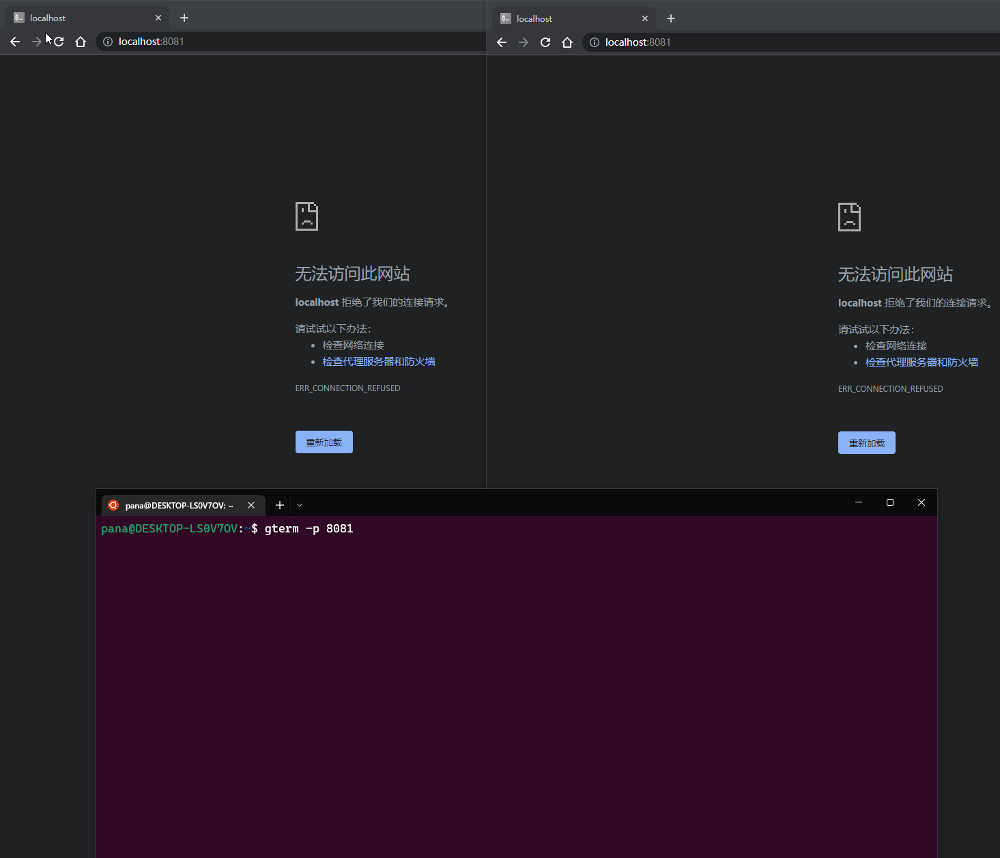

# GTERM - 💕Share your terminal as a web application💕

[][gomod]
[][release]
[][license]

[gomod]: https://github.com/iotxfoundry/gterm/blob/master/go.md
[release]: https://github.com/iotxfoundry/gterm/releases
[license]: https://github.com/iotxfoundry/gterm/blob/master/LICENSE

GTERM is a tool to share your terminal as a web applications.

Unlike [gotty](https://github.com/yudai/gotty), we use the same terminal, so we can see the commands from others.



# Installation

## `go install`

GTerm requires go1.16 or later.

```sh
$ go install github.com/iotxfoundry/gterm/cmd/gterm@latest
```

## Usage

```sh
Usage:
  gterm [OPTIONS]

Application Options:
  -p, --port= http port (default: 8080)

Help Options:
  -h, --help  Show this help message
```

## License

The MIT License
